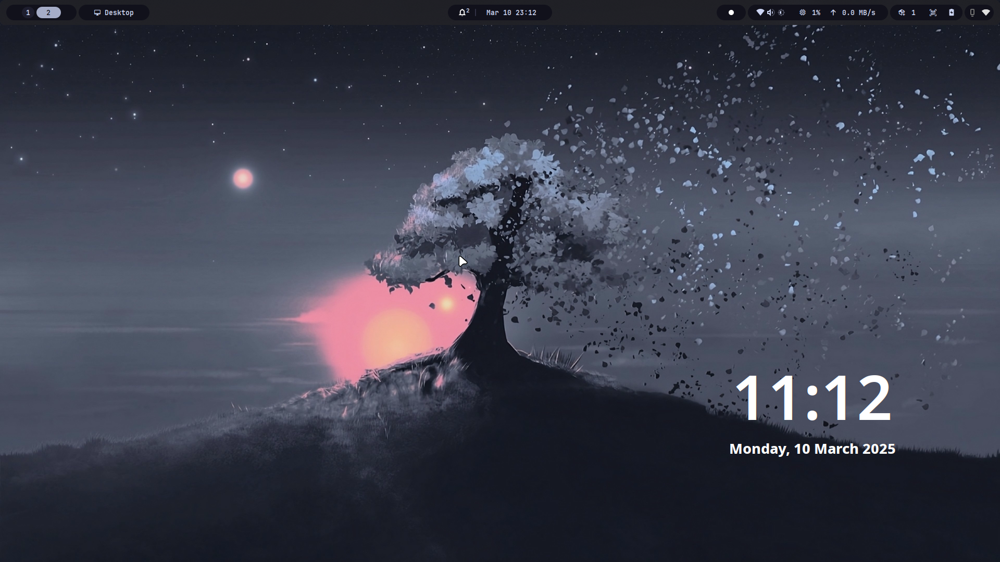
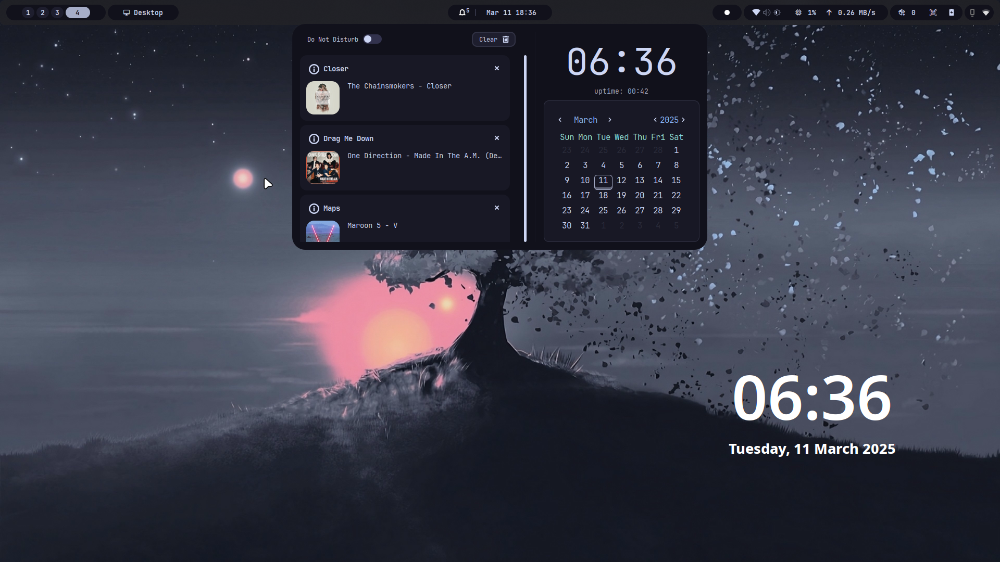
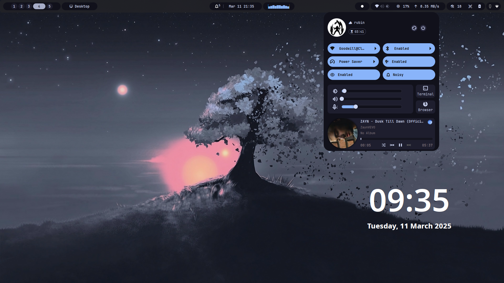
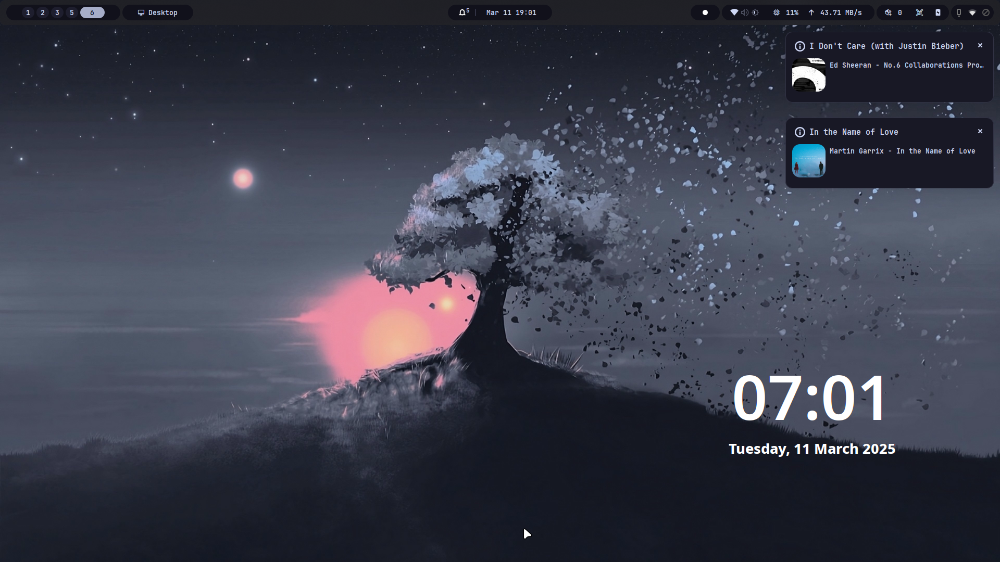
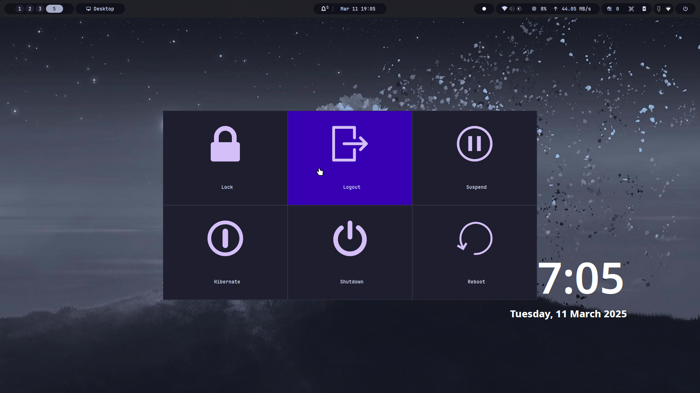

<p align="center"></p>
<h1 align="center"> Tsumiki </h1>
<p align="center">
 <a href="https://github.com/rubiin/Tsumiki/blob/master/LICENSE"></a>
  <a href='http://makeapullrequest.com'></a>
  
  
  
</p>


Tsumiki (formerly Hydepanel) is a modular status bar for the Hyprland Wayland compositor. Built on [Fabric Widget System](https://github.com/Fabric-Development/fabric), it offers a flexible architecture for building custom panels with individual widgets. It’s designed to be lightweight, performant, and user-configurable.


The name Tsumiki (pronounced as su-me-ki) comes from the Japanese word "tsumiki" (積み木), which means "building blocks". Just like toy blocks that stack together to form something greater, Tsumiki is designed to be modular, lightweight, and easy to build upon

<h2><sub></sub> Screenshots</h2>

<table align="center">
  <tr>
    <td colspan="4"></td>
  </tr>
    <tr>
    <td colspan="4"></td>
  </tr>
  <tr>
    <td colspan="1"></td>
    <td colspan="1"></td>
    <td colspan="1" align="center"></td>
    <td colspan="1" align="center"></td>
  </tr>
</table>

<table align="center">
  <tr>
    <td align="center"><sup>✨ sᴜᴘᴘᴏʀᴛ ᴛʜᴇ ᴘʀᴏᴊᴇᴄᴛ ✨</sup></td>
  </tr>
  <tr>
    <td align="center">
      <a href='https://ko-fi.com/rubiin' target='_blank'>
        
      </a>
    </td>
  </tr>
</table>

---

## ✨ Features

- 🖥 **Tailored for Hyprland**
  Built with full support for Hyprland’s ecosystem and event model.

- 🧩 **Modular Widget System**
  Includes pluggable widgets for Dock, Launcher, CPU, memory, network, media playback, battery, and more.

- 🎨 **Fully Themeable**
  Customize fonts, colors, layouts, and behavior using the power of Fabric.

- ⚙️ **Highly Configurable**
  Control the positioning, behavior, and appearance of every widget and element. Tailor the experience to fit your exact needs.

- ⚡ **Lightweight & Fast**
  Designed with performance in mind — minimal memory and CPU usage.

- 📢 **On-Screen Display (OSD) Support**
  Display real-time notifications or alerts directly on the screen (e.g., for volume, media, or custom events) in a visually appealing overlay.

- 🛎️ **Notification System**
  Integrated notification support allows the panel to show alerts from your system, apps, or scripts. Notifications can be styled, timed, and customized based on user preferences.


## Prerequisites

- [JetBrains Nerd Font](https://www.nerdfonts.com)
- [python 3+](https://www.python.org/downloads/)

---

> [!NOTE]
> You need a functioning Hyprland installation.

## **Installation**

### Required

Most of these are already installed on existing working machines

```sh
## network
networkmanager

## Sound
pipewire

## Bluetooth menu utilities
gnome-bluetooth-3.0 # aur
bluez
bluez-utils

## Compiler for sass/scss
dart-sass

## Brightness module for OSD
brightnessctl

## To open and execute commands in a terminal ex: updates, cava

kitty
```

### Optional

```sh

## To check for updates using the default pacman script in the updates module
pacman-contrib

## To display cava audio visualizer
cava

## To switch between power profiles in the battery module
power-profiles-daemon

## To record screen through recorder module
wf-recorder & slurp

## To activate Hyprland’s native blue light filter
hyprsunset

## To activate Hyprland’s native idle inhibitor
hypridle

## To use media module on quick settings
playerctl

## To use the clipboard module
cliphist

```

- Clone this repository:

```sh
git clone https://github.com/rubiin/Tsumiki.git ~/.config/tsumiki
cd bar
```

- Run the following command to install the required packages for particular os, few of them are already installed if you have a working system:

## Installation

You can choose one of two installation methods: **Automated Setup** or **Manual Setup**.

### Option 1: Automated Setup Using `init.sh -install`

1.  **Run the `init.sh -install` script** to automatically install all the required packages and dependencies (both `pacman` and AUR packages):

```sh
./init.sh -install
```

This script will:

- Install all required `pacman` and AUR packages.
- Set up the virtual environment and any required configurations.

1.  **Start the environment or bar** once the installation is complete:

```sh
./init.sh -start
```

This will launch the environment or bar as defined in your project.

### Option 2: Manual Setup (Install Dependencies First)

If you prefer to have more control over the installation process, you can install the required dependencies manually and then run the `init.sh -start` script.

#### Step 1: Install `pacman` Packages

Run the following command to install the required system packages:

```sh
sudo pacman -S --noconfirm --needed pipewire playerctl dart-sass power-profiles-daemon networkmanager brightnessctl pkgconf wf-recorder kitty python pacman-contrib gtk3 cairo gtk-layer-shell libgirepository noto-fonts-emoji gobject-introspection gobject-introspection-runtime python-pip python-gobject python-psutil python-cairo python-loguru python-setproctitle libnotify cliphist python-requests satty
```

#### Step 2: Install AUR Packages

Using `yay` to install the required AUR packages:

```sh
yay -S --needed gray-git 	python-fabric-git gnome-bluetooth-3.0 python-rlottie-python python-pytomlpp slurp imagemagick tesseract tesseract-data-eng python-pyjson5 ttf-jetbrains-mono-nerd grimblast-git python-ijson
```

If you have something else besides `yay`, install with the respective aur helper.

#### Step 3: Run the `init.sh -start` Script

Once the dependencies are installed, run the following command to start the bar or environment:

```sh
./init.sh -start
```

## **Usage**

Add this to your `.config/hyprland.conf`

```sh
exec = `~/.config/tsumiki/init.sh -start`

```

> **Note**: modify the path accordingly

Check FAQs for common things you are likely to encounter

## Updating

Updating to latest commit is fairly simple, just git pull the latest changes.

> **Note**: make sure to keep the config safe just in case

## Check [wiki](https://github.com/rubiin/Tsumiki/wiki) for configuring individual widgets

## **Available Modules**

| **Item**              | **Description**                                                                |
| --------------------- | ------------------------------------------------------------------------------ |
| **battery**           | Widget that display battery status and usage information.                      |
| **bluetooth**         | Widget manages Bluetooth connections and settings.                             |
| **brightness**        | Widget controls the screen brightness level.                                   |
| **cava**              | An audio visualizer widget.                                                    |
| **click_counter**     | Widget tracks the number of mouse clicks.                                      |
| **cliphist**          | Widget for the clipboard history.                                              |
| **custom_button_group** | Widget that defines a group of customizable buttons for executing shell commands. Buttons are not displayed as a group but can be individually placed anywhere in the layout using `@custom_button:0`, `@custom_button:1`, etc. Each button can have custom icons, labels, tooltips, and execute different commands when clicked. |
| **cpu**               | Widget displays CPU usage and performance statistics.                          |
| **date_time**         | A menu displaying the current date and notifications.                          |
| **divider (utility)** | Widget separates sections in a user interface for better organization.         |
| **emoji_picker**      | Widget that allows users to select and insert emojis.                          |
| **hypridle**         | Widget that tracks idle time or status of the system.                          |
| **hyprpicker**       | Widget that picks color from images.                                           |
| **hyprsunset**       | Widget that adjusts screen settings based on the time of sunset.               |
| **keyboard**          | Widget that manages and manages the keyboard layout or settings.               |
| **window_count**      | Widget that shows window count on active workspace.                            |
| **language**          | Widget allows selection of the system's language or locale settings.           |
| **media**             | Widget controls media playback, volume, or other media-related settings.       |
| **microphone**        | Widget manages microphone settings and input levels.                           |
| **network_usage**     | Widget displays the upload/download speeds.                                    |
| **ocr**               | Widget scans text from an image.                                               |
| **overview**          | Widget displays running applications in workspaces.                            |
| **power**             | Widget controls power-related settings, including sleep and shutdown.          |
| **ram**               | Widget displays information about system RAM usage and performance.            |
| **recorder**          | Widget for recording video on the system.                                      |
| **screenshot**       | Widget for taking screenshot on the system.                                    |
| **spacer (utility)**  | A simple utility for adding space in UI layouts.                               |
| **storage**           | Widget that displays storage usage and manages disk partitions or drives.      |
| **submap**            | Widget that displays active submap for hyprland.                               |
| **stopwatch**        | A utility for tracking elapsed time, like a timer or stopwatch.                |
| **system_tray**       | Widget that displays system tray icons and manages notifications.              |
| **taskbar**           | A bar at the bottom of the screen for quick access to apps and notifications.  |
| **updates**           | Widget that manages system updates, patches, and version upgrades.             |
| **quick_settings**    | Displays panel for quickly accessing some settings like brightness, sound etc. |
| **volume**            | Widget that controls the system’s audio volume.                                |
| **weather**           | Widget that displays current weather information or forecasts.                 |
| **window_title**      | Widget that shows the title of the current window or application.              |
| **workspaces**        | Widget that displays virtual desktops or workspaces.                           |
| **world_clock**       | Widget that displays clock for various timezones.                              |

> [!WARNING]
> This is still in early development and will include breaking changes

## Frequently Asked Questions (FAQ)

### 1. **Cannot see system tray?**

Be sure to kill any bars that you may be running. You can kill other bar with `pkill bar-name`

### 2. **Cannot see notifications?**

Be sure to kill other notifications daemon that you may be running. You can kill other daemons with `pkill dunst; pkill mako;`

### 3. **Cannot see bar?**

Kill the app with `pkill tsumiki`. Run `init.sh -start`. This should show some logs. If it shows like `ModuleNotFoundError`, run `pip install -r requirements.txt`. If this does not solve the issue, do report a bug with screenshot of the log.

### 4. **No Blur?**

Add this to your `hyprland.conf`

```conf
layerrule = blur , fabric
layerrule = ignorezero, fabric
layerrule = blur ,gtk-layer-shell
layerrule = ignorezero ,gtk-layer-shell

```

### 5. **No Icons?**
Make sure your icon theme has the required icons. One of the recommended icon theme is  `Tela Circle`

### 6. **Hide bar on keypress?**

Add this to your `hyprland.conf`

```conf
bind = SUPER, Q, exec,  fabric-cli ia tsumiki toggle bar
```


## Contributing

We welcome all sorts of contributions, no matter how small, to this project! Please see the [CONTRIBUTING.md](CONTRIBUTING.md) file for guidelines on how to contribute.

## Acknowledgements

- **Waybar** - A lot of the initial inspiration, and a pretty great bar.
  [Waybar GitHub Repository](https://github.com/Alexays/Waybar)

- **Hyprpanel** - Served as inspiration for some of the panel's features and design choices, with its focus on dynamic and customizable Hyprland panels.
  [Hyprpanel GitHub Repository](https://github.com/Jas-SinghFSU/HyprPanel)

## Special Thanks

A big thank you to the following people for their amazing help with code, bug fixes, and great ideas:

- [darsh](https://github.com/its-darsh): For creating fabric without which the project wouldn't have existed. Also, your quick feedbacks and problem-solving approach were a game-changer!
- [gummy bear album](https://github.com/muhchaudhary): For providing code snippets which served as a reference to start stuffs. Your creative ideas really pushed the project forward and made it better!
- [axenide](https://github.com/Axenide): For your fresh ideas and design references. Your code improvements and insights made a significant impact
- [sankalp](https://github.com/S4NKALP): For some bug fixes and recommendations,contributions in optimizing the code and identifying subtle bugs during the development period

# ⭐ Hit that Star Button!

Like what you see? Think this project is cooler than your morning coffee? ☕✨

Give it a star! It’s like giving a virtual high-five to the code—plus, and who doesn't love high-fives? ✋

Your star helps the project get noticed, and it makes us do a little happy dance. 💃

Just click the shiny "Star" button at the top right (it’s begging for your attention). 🥳

Thanks for making this project a little bit more awesome! 🚀

## Star History

<a href="https://star-history.com/#rubiin/Tsumiki&Timeline">
 <picture>
   <source media="(prefers-color-scheme: dark)" srcset="https://api.star-history.com/svg?repos=rubiin/Tsumiki&type=Timeline&theme=dark" />
   <source media="(prefers-color-scheme: light)" srcset="https://api.star-history.com/svg?repos=rubiin/Tsumiki&type=Timeline" />
   
 </picture>
</a>

## Contributors ✨

Thanks goes to these wonderful people ([emoji key](https://allcontributors.org/docs/en/emoji-key)):

<!-- ALL-CONTRIBUTORS-LIST:START - Do not remove or modify this section -->
<!-- prettier-ignore-start -->
<!-- markdownlint-disable -->
<table>
  <tbody>
    <tr>
      <td align="center" valign="top" width="14.28%"><a href="https://github.com/PixelKhaos"><br /><sub><b>Robin Seger</b></sub></a><br /><a href="https://github.com/rubiin/Tsumiki/commits?author=PixelKhaos" title="Code">💻</a> <a href="#design-PixelKhaos" title="Design">🎨</a></td>
      <td align="center" valign="top" width="14.28%"><a href="https://zaap.bio/Axenide"><br /><sub><b>Adriano Tisera</b></sub></a><br /><a href="https://github.com/rubiin/Tsumiki/commits?author=Axenide" title="Code">💻</a> <a href="https://github.com/rubiin/Tsumiki/issues?q=author%3AAxenide" title="Bug reports">🐛</a></td>
      <td align="center" valign="top" width="14.28%"><a href="https://github.com/Anshul-007"><br /><sub><b>Anshul J.</b></sub></a><br /><a href="https://github.com/rubiin/Tsumiki/commits?author=Anshul-007" title="Code">💻</a></td>
      <td align="center" valign="top" width="14.28%"><a href="https://github.com/S4NKALP"><br /><sub><b>Sankalp Tharu</b></sub></a><br /><a href="https://github.com/rubiin/Tsumiki/issues?q=author%3AS4NKALP" title="Bug reports">🐛</a></td>
      <td align="center" valign="top" width="14.28%"><a href="https://github.com/keepo-dot"><br /><sub><b>Keepo</b></sub></a><br /><a href="https://github.com/rubiin/Tsumiki/commits?author=keepo-dot" title="Code">💻</a></td>
      <td align="center" valign="top" width="14.28%"><a href="https://evrenos-dev.vercel.app/"><br /><sub><b>Sayeed Mahmood Evrenos</b></sub></a><br /><a href="https://github.com/rubiin/Tsumiki/issues?q=author%3AEvren-os" title="Bug reports">🐛</a></td>
      <td align="center" valign="top" width="14.28%"><a href="http://xeyossr.github.io"><br /><sub><b>xeyossr</b></sub></a><br /><a href="https://github.com/rubiin/Tsumiki/commits?author=xeyossr" title="Documentation">📖</a></td>
    </tr>
    <tr>
      <td align="center" valign="top" width="14.28%"><a href="https://dimflix-official.github.io/"><br /><sub><b>DIMFLIX</b></sub></a><br /><a href="https://github.com/rubiin/Tsumiki/issues?q=author%3ADIMFLIX-OFFICIAL" title="Bug reports">🐛</a></td>
      <td align="center" valign="top" width="14.28%"><a href="https://github.com/jhakonen"><br /><sub><b>Janne Hakonen</b></sub></a><br /><a href="https://github.com/rubiin/Tsumiki/issues?q=author%3Ajhakonen" title="Bug reports">🐛</a></td>
      <td align="center" valign="top" width="14.28%"><a href="https://github.com/fdev31"><br /><sub><b>Fabien Devaux</b></sub></a><br /><a href="https://github.com/rubiin/Tsumiki/issues?q=author%3Afdev31" title="Bug reports">🐛</a></td>
    </tr>
  </tbody>
</table>

<!-- markdownlint-restore -->
<!-- prettier-ignore-end -->

<!-- ALL-CONTRIBUTORS-LIST:END -->

This project follows the [all-contributors](https://github.com/all-contributors/all-contributors) specification. Contributions of any kind welcome!
